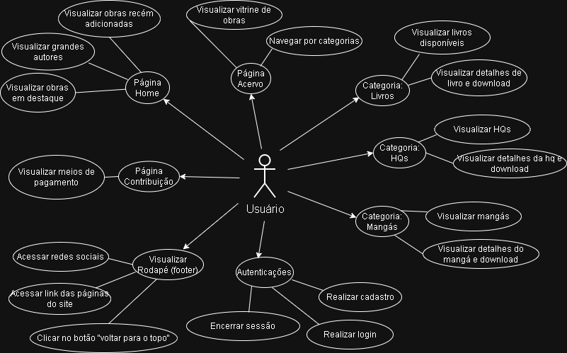

# Biblioteca Digital 
Plataforma de Biblioteca Digital voltada à divulgação e acesso a obras literárias (livros, HQs e mangás), com foco em autores clássicos, acervo navegável, autenticação de usuários e área de contribuição.

# Navegação Rápida
- [História de Usuário](#história-de-usuario)
- [Diagrama Caso de Uso](#diagrama-caso-de-uso)
- [Diagrama Sequencial](#diagrama-sequencial)
- [Backlog](#backlog)
- [Autor](#autor)

# História de Usuário

  
<h2>Requisitos Funcionais</h2>

  <h3>🔎 Navegação Geral</h3>
  <ul>
      <li> Como visitante, quero acessar a página inicial para conhecer a proposta da biblioteca. </li>
      <li> Como visitante, quero navegar pelo menu principal para acessar seções como Home, Acervo, Livros, HQs, Mangás e Contribuir. </li>
      <li> Como visitante, quero utilizar a barra de pesquisa para localizar obras ou autores rapidamente. </li>
  </ul>

  <h3>🏠 Página Inicial (Home)</h3>
  <ul>
      <li> Como visitante, quero visualizar destaques de obras para descobrir conteúdos relevantes. </li>
      <li> Como visitante, quero acessar atalhos para o acervo completo a partir da página inicial. </li>
      <li> Como visitante, quero visualizar carrosséis de livros para explorar o conteúdo de forma dinâmica. </li>
  </ul>

  <h3>📚 Acervo</h3>
  <ul>
      <li> Como visitante, quero visualizar o acervo organizado por categorias para facilitar a navegação. </li>
      <li> Como visitante, quero percorrer listas horizontais de obras para descobrir novos títulos. </li>
      <li> Como visitante, quero clicar em um item do acervo para acessar seus detalhes. </li>
  </ul>

  <h3>✍️ Autores</h3>
  <ul>
      <li> Como visitante, quero acessar páginas dedicadas a autores para conhecer sua biografia. </li>
      <li> Como visitante, quero visualizar a lista de obras de um autor específico. </li>
      <li> Como visitante, quero identificar a quantidade de obras disponíveis por autor. </li>
  </ul>

  <h3>📖 Livros</h3>
  <ul>
      <li> Como visitante, quero acessar uma seção exclusiva para livros. </li>
      <li> Como visitante, quero visualizar uma grade de livros disponíveis. </li>
      <li> Como visitante, quero identificar título, autor e capa de cada livro. </li>
      <li> Como visitante, quero selecionar um livro para obter mais informações. </li>
  </ul>

  <h3>🖼️ HQs e Mangás</h3>
  <ul>
      <li> Como visitante, quero acessar uma seção exclusiva para HQs. </li>
      <li> Como visitante, quero acessar uma seção exclusiva para mangás. </li>
      <li> Como visitante, quero visualizar livros, HQs e mangás organizados em formato de grade. </li>
  </ul>

  <h3>🔐 Autenticação</h3>
  <ul>
      <li> Como usuário, quero criar uma conta para acessar funcionalidades exclusivas. </li>
      <li> Como usuário, quero realizar login utilizando e-mail e senha. </li>
      <li> Como usuário, quero receber feedback visual em caso de erro de autenticação. </li>
  </ul>

  <h3>🤝 Contribuição</h3>
  <ul>
      <li> Como visitante, quero acessar a página de contribuição para apoiar a biblioteca. </li>
      <li> Como visitante, quero visualizar diferentes planos ou níveis de contribuição. </li>
      <li> Como visitante, quero entender os benefícios associados a cada nível de apoio. </li>
  </ul>

  <h3>📌 Rodapé (Footer)</h3>
  <ul>
      <li> Como visitante, quero acessar links institucionais pelo rodapé. </li>
      <li> Como visitante, quero visualizar informações de contato e redes sociais. </li>
      <li> Como visitante, quero me inscrever para receber atualizações da biblioteca. </li>
  </ul>

  
<h2>Requisitos Não Funcionais</h2>

  <h3>🎯 Usabilidade</h3>
    <ul>
      <li> Como usuário, quero uma interface intuitiva para navegar sem dificuldade. </li>
      <li> Como usuário, quero um layout consistente entre as páginas. </li>
    </ul>
    
  <h3>⚡ Desempenho</h3>
    <ul>
      <li> Como usuário, quero que as páginas carreguem rapidamente. </li> 
      <li> Como usuário, quero que carrosséis e grids sejam responsivos. </li>
    </ul>
    
  <h3>📱 Responsividade</h3>
    <ul>
      <li> Como usuário, quero acessar o sistema em dispositivos móveis sem perda de funcionalidade. </li>
      <li> Como usuário, quero que os elementos se adaptem a diferentes tamanhos de tela. </li>
    </ul>
    
  <h3>🛡️ Segurança</h3>
    <ul>
        <li> Como usuário, quero que meus dados de login sejam protegidos. </li>
        <li> Como usuário, quero que o sistema impeça acessos não autorizados a áreas restritas. </li>
    </ul>
    
  <h3>🛠️ Manutebilidade</h3>
    <ul>
        <li> Como administrador, quero que o sistema seja modular para facilitar futuras manutenções. </li>
        <li> Como administrador, quero que novas obras possam ser adicionadas sem alterar a estrutura principal. </li>
    </ul>
    
  <h3>♿ Acessibilidade</h3>
    <ul>
        <li> Como usuário, quero contraste adequado entre texto e fundo. </li>
        <li> Como usuário, quero textos legíveis e botões identificáveis. </li>
    </ul>
    
  <h3>✅ Confiabilidade</h3>
    <ul>
        <li> A biblioteca digital deve estar disponível continuamente, garantindo acesso aos alunos sem interrupções significativas. </li>
    </ul>
    
  <h3>🌐 Portabilidade</h3>
    <ul>
        <li> O site deve funcionar corretamente em diferentes dispositivos móveis e sistemas operacionais, garantindo compatibilidade ampla. </li>
    </ul>
    
  <h3>📈 Escalabilidade</h3>
    <ul>
        <li> O sistema deve suportar aumentos significativos de usuários simultâneos, especialmente durante períodos de rematrícula ou matrícula. </li>
    </ul>

# Diagrama Caso de Uso

# Diagrama Sequencial 
)

# Backlog

# Autor 
- Lucas Viana

